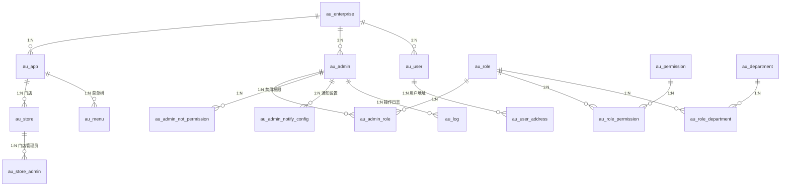
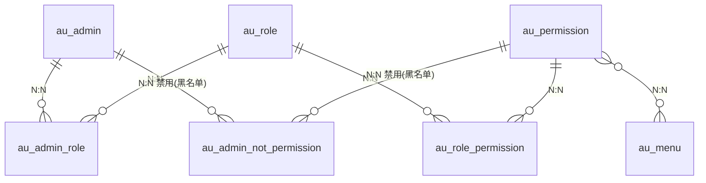

# 用户模块数据库设计文档

> 版本：v1.0  
> 日期：2026-08-21  
> 数据库：MySQL（库名 `t_all`）  
> 字符集：utf8mb4

---

## 目 录

1. [ER 图](#1-er-图)
2. [表清单](#2-表清单)
3. [表定义详述](#3-表定义详述)
4. [枚举与常量](#4-枚举与常量)
5. [索引建议](#5-索引建议)

---

## 1. ER 图

### 1.1 核心关系总览



> **关系说明**：`au_enterprise` 为多租户根，通过 `en_id` 字段隔离所有业务表；`au_menu` 经 `pid` 自关联构成菜单树，`au_department` 经 `pid` 自关联构成部门树；`conf_sys` 为系统全局配置，独立于租户体系。

### 1.2 权限模型关系图



> 权限模型说明：
> - 管理员通过 `au_admin_role` 关联到角色
> - 角色通过 `au_role_permission` 关联到权限点
> - 管理员还可通过 `au_admin_not_permission` 单独禁用某些权限（黑名单模式）
> - 菜单（`au_menu`）挂载于应用（`au_app`）下，构成树形结构

---

## 2. 表清单

| 序号 | 表名 | 中文名 | 业务说明 |
| --- | --- | --- | --- |
| 1 | `au_enterprise` | 企业表 | 运营企业/租户信息，多租户隔离的根 |
| 2 | `au_app` | 应用表 | 企业下的应用系统（如停车系统、商城系统等） |
| 3 | `au_store` | 门店表 | 门店档案 |
| 4 | `au_store_admin` | 门店管理员表 | 门店管理员账号 |
| 5 | `au_admin` | 企业管理员表 | 企业后台管理人员账号 |
| 6 | `au_admin_role` | 管理员角色关联表 | 管理员与角色的多对多关联 |
| 7 | `au_admin_not_permission` | 管理员禁用权限表 | 管理员单独禁用的权限（黑名单模式） |
| 8 | `au_admin_notify_config` | 管理员通知设置表 | 管理员个人通知偏好设置 |
| 9 | `au_role` | 角色表 | 系统角色定义 |
| 10 | `au_role_permission` | 角色权限关联表 | 角色与权限的多对多关联 |
| 11 | `au_role_department` | 角色部门关联表 | 角色与部门的多对多关联 |
| 12 | `au_permission` | 权限表 | 功能权限点定义 |
| 13 | `au_menu` | 菜单表 | 系统菜单树 |
| 14 | `au_department` | 部门表 | 企业组织部门 |
| 15 | `au_log` | 操作日志表 | 登录日志与操作审计 |
| 16 | `au_user` | 终端用户表 | 终端车主用户账号 |
| 17 | `au_user_address` | 用户地址表 | 终端用户收货地址 |
| 18 | `conf_sys` | 系统配置表 | 系统全局参数配置 |

---

## 3. 表定义详述

### 3.1 公共基类字段

所有业务表均继承自 `BaseEntity`，包含以下公共字段：

| 字段名 | 类型 | 约束 | 说明 |
| --- | --- | --- | --- |
| `id` | bigint | PK, AUTO_INCREMENT | 主键ID（JSON 序列化为字符串防精度溢出） |
| `en_id` | bigint | NOT NULL | 所属企业ID（多租户隔离字段） |
| `create_time` | datetime | DEFAULT now() | 创建时间 |
| `update_time` | datetime | DEFAULT now() | 更新时间 |
| `note` | varchar(255) | DEFAULT '' | 备注 |
| `del_time` | int | NOT NULL DEFAULT 0 | 删除时间（0 表示未删除，逻辑删除用） |

### 3.2 au_enterprise —— 企业表

**表名**：`au_enterprise`  
**实体类**：`AuEnterprise`  
**说明**：运营企业/租户信息，是多租户模型的根实体。所有业务表通过 `en_id` 字段与该表关联实现数据隔离。

| 字段名 | 类型 | 约束 | 说明 |
| --- | --- | --- | --- |
| `name` | varchar(100) | | 企业名称 |
| `logo` | varchar(255) | | Logo URL |
| `code` | varchar(50) | UNIQUE, NOT NULL | 企业编码 |
| `person` | varchar(50) | | 联系人 |
| `root_account` | varchar(50) | | 企业管理员账号 |
| `phone` | varchar(20) | UNIQUE | 联系电话 |
| `address` | varchar(255) | | 地址 |
| `status` | int | DEFAULT 1 | 状态{0:禁用,1:启用} |

**DDL 参考**：
```sql
CREATE TABLE `au_enterprise` (
    `id`           bigint       NOT NULL AUTO_INCREMENT COMMENT 'id',
    `en_id`        bigint       NOT NULL COMMENT '所属企业ID',
    `name`         varchar(100) DEFAULT NULL COMMENT '企业名称',
    `logo`         varchar(255) DEFAULT NULL COMMENT 'logo',
    `code`         varchar(50)  NOT NULL COMMENT '企业编码',
    `person`       varchar(50)  DEFAULT NULL COMMENT '联系人',
    `root_account` varchar(50)  DEFAULT NULL COMMENT '企业管理员账号',
    `phone`        varchar(20)  DEFAULT NULL COMMENT '联系电话',
    `address`      varchar(255) DEFAULT NULL COMMENT '地址',
    `status`       int          DEFAULT 1 COMMENT '状态{0:禁用,1:启用}',
    `create_time`  datetime     DEFAULT now() COMMENT '创建时间',
    `update_time`  datetime     DEFAULT now() COMMENT '更新时间',
    `note`         varchar(255) DEFAULT '' COMMENT '备注',
    `del_time`     int          NOT NULL DEFAULT 0 COMMENT '删除时间',
    PRIMARY KEY (`id`),
    UNIQUE KEY `uk_code` (`code`),
    UNIQUE KEY `uk_phone` (`phone`)
) ENGINE=InnoDB DEFAULT CHARSET=utf8mb4 COMMENT='企业';
```

### 3.3 au_app —— 应用表

**表名**：`au_app`  
**实体类**：`AuApp`  
**说明**：企业下的应用系统。一个企业可拥有多个应用（如停车系统、商城系统、点餐系统等），用于区分不同业务线的用户体系。

| 字段名 | 类型 | 约束 | 说明 |
| --- | --- | --- | --- |
| `code` | varchar(50) | UNIQUE | APP编号（如 `system`, `shopping`, `travel`, `food`, `iot` 等） |
| `name` | varchar(100) | | APP名称 |
| `logo` | varchar(255) | | Logo URL |
| `type` | varchar(64) | | 类型 |

**枚举值（`AppEnum`）**：

| code | 名称 | 说明 |
| --- | --- | --- |
| `system` | 企业系统 | 整合核心信息，助决策者掌动态、定规划 |
| `shopping` | 购物商城 | 精选商品齐聚，便捷购好物 |
| `travel` | 旅行和预订APP | 预订机票酒店，规划行程 |
| `furniture` | 家具概念应用 | 家具展示和销售平台 |
| `englishWord` | 英语词典 | 智能记忆发音评测 |
| `iot` | 物联网 | 物物互联的智能网络 |
| `food` | 点餐系统 | 线上下单、商家接单配餐 |

**DDL 参考**：
```sql
CREATE TABLE `au_app` (
    `id`          bigint       NOT NULL AUTO_INCREMENT COMMENT 'id',
    `en_id`       bigint       NOT NULL COMMENT '所属企业ID',
    `code`        varchar(50)  DEFAULT NULL COMMENT 'APP编号',
    `name`        varchar(100) DEFAULT NULL COMMENT 'APP名称',
    `logo`        varchar(255) DEFAULT NULL COMMENT 'logo',
    `type`        varchar(64)  DEFAULT NULL COMMENT '类型',
    `create_time` datetime     DEFAULT now() COMMENT '创建时间',
    `update_time` datetime     DEFAULT now() COMMENT '更新时间',
    `note`        varchar(255) DEFAULT '' COMMENT '备注',
    `del_time`    int          NOT NULL DEFAULT 0 COMMENT '删除时间',
    PRIMARY KEY (`id`),
    UNIQUE KEY `uk_code` (`code`)
) ENGINE=InnoDB DEFAULT CHARSET=utf8mb4 COMMENT='企业APP';
```

### 3.4 au_store —— 门店表

**表名**：`au_store`  
**实体类**：`AuStore`  
**说明**：门店档案。门店隶属于应用（`au_app`）。

| 字段名 | 类型 | 约束 | 说明 |
| --- | --- | --- | --- |
| `app_id` | bigint | | 所属APPID |
| `name` | varchar(100) | | 门店名称 |
| `code` | varchar(50) | | 门店编码 |
| `contact_person` | varchar(50) | | 联系人 |
| `contact_phone` | varchar(20) | | 联系电话 |
| `address` | varchar(255) | | 地址 |
| `introduction` | text | | 简介 |
| `certificate_type` | int | | 证件类型{0:身份证,1:营业执照} |
| `certificate` | text | | 证件内容 |
| `status` | int | DEFAULT 1 | 状态{0:提交审核,1:正常,2:禁用} |

**DDL 参考**：
```sql
CREATE TABLE `au_store` (
    `id`               bigint       NOT NULL AUTO_INCREMENT COMMENT 'id',
    `en_id`            bigint       NOT NULL COMMENT '所属企业ID',
    `app_id`           bigint       DEFAULT NULL COMMENT '所属APPID',
    `name`             varchar(100) DEFAULT NULL COMMENT '门店名称',
    `code`             varchar(50)  DEFAULT NULL COMMENT '门店编码',
    `contact_person`   varchar(50)  DEFAULT NULL COMMENT '联系人',
    `contact_phone`    varchar(20)  DEFAULT NULL COMMENT '联系电话',
    `address`          varchar(255) DEFAULT NULL COMMENT '地址',
    `introduction`     text         DEFAULT NULL COMMENT '简介',
    `certificate_type` int          DEFAULT NULL COMMENT '证件类型{0:身份证,1:营业执照}',
    `certificate`      text         DEFAULT NULL COMMENT '证件',
    `status`           int          DEFAULT 1 COMMENT '状态{0:提交审核,1:正常,2:禁用}',
    `create_time`      datetime     DEFAULT now() COMMENT '创建时间',
    `update_time`      datetime     DEFAULT now() COMMENT '更新时间',
    `note`             varchar(255) DEFAULT '' COMMENT '备注',
    `del_time`         int          NOT NULL DEFAULT 0 COMMENT '删除时间',
    PRIMARY KEY (`id`),
    KEY `idx_app_id` (`app_id`)
) ENGINE=InnoDB DEFAULT CHARSET=utf8mb4 COMMENT='门店';
```

### 3.5 au_store_admin —— 门店管理员表

**表名**：`au_store_admin`  
**实体类**：`AuStoreAdmin`  
**说明**：门店的管理员账号。与 `au_admin` 结构相似，但归属于具体门店，权限范围限定在门店内。

| 字段名 | 类型 | 约束 | 说明 |
| --- | --- | --- | --- |
| `app_id` | bigint | | 所属APPID |
| `store_id` | bigint | | 所属门店ID |
| `account` | varchar(50) | | 账号 |
| `phone` | varchar(15) | | 手机号 |
| `nick_name` | varchar(50) | | 昵称 |
| `password` | varchar(100) | | 密码 |
| `avatar` | varchar(255) | | 头像 |
| `real_name` | varchar(50) | | 真实姓名 |
| `gender` | int | | 性别{0:未知,1:男,2:女} |
| `birthday` | date | | 生日 |
| `email` | varchar(100) | | 邮箱 |
| `status` | int | DEFAULT 1 | 状态{0:禁用,1:启用} |
| `last_login_time` | datetime | | 最后登录时间 |

**DDL 参考**：
```sql
CREATE TABLE `au_store_admin` (
    `id`              bigint       NOT NULL AUTO_INCREMENT COMMENT 'id',
    `en_id`           bigint       NOT NULL COMMENT '所属企业ID',
    `app_id`          bigint       DEFAULT NULL COMMENT '所属APPID',
    `store_id`        bigint       DEFAULT NULL COMMENT '所属门店ID',
    `account`         varchar(50)  DEFAULT NULL COMMENT '账号',
    `phone`           varchar(15)  DEFAULT NULL COMMENT '手机号',
    `nick_name`       varchar(50)  DEFAULT NULL COMMENT '昵称',
    `password`        varchar(100) DEFAULT NULL COMMENT '密码',
    `avatar`          varchar(255) DEFAULT NULL COMMENT '头像',
    `real_name`       varchar(50)  DEFAULT NULL COMMENT '真实姓名',
    `gender`          int          DEFAULT NULL COMMENT '性别{0:未知,1:男,2:女}',
    `birthday`        date         DEFAULT NULL COMMENT '生日',
    `email`           varchar(100) DEFAULT NULL COMMENT '邮箱',
    `status`          int          DEFAULT 1 COMMENT '状态{0:禁用,1:启用}',
    `last_login_time` datetime     DEFAULT NULL COMMENT '最后登录时间',
    `create_time`     datetime     DEFAULT now() COMMENT '创建时间',
    `update_time`     datetime     DEFAULT now() COMMENT '更新时间',
    `note`            varchar(255) DEFAULT '' COMMENT '备注',
    `del_time`        int          NOT NULL DEFAULT 0 COMMENT '删除时间',
    PRIMARY KEY (`id`),
    KEY `idx_store_id` (`store_id`),
    KEY `idx_app_id` (`app_id`),
    KEY `idx_account` (`account`)
) ENGINE=InnoDB DEFAULT CHARSET=utf8mb4 COMMENT='门店管理员';
```

### 3.6 au_admin —— 企业管理员表

**表名**：`au_admin`  
**实体类**：`AuAdmin`  
**说明**：企业后台管理人员账号，用于登录后台管理系统。通过角色关联获得权限。

| 字段名 | 类型 | 约束 | 说明 |
| --- | --- | --- | --- |
| `account` | varchar(50) | | 账号（登录用户名） |
| `phone` | varchar(15) | | 手机号 |
| `nick_name` | varchar(50) | | 昵称 |
| `password` | varchar(100) | | 密码 |
| `avatar` | varchar(255) | | 头像 |
| `real_name` | varchar(50) | | 真实姓名 |
| `gender` | int | | 性别{0:未知,1:男,2:女} |
| `birthday` | date | | 生日 |
| `email` | varchar(100) | | 邮箱 |
| `status` | int | DEFAULT 1 | 状态{0:禁用,1:启用} |
| `last_login_time` | datetime | | 最后登录时间 |

**DDL 参考**：
```sql
CREATE TABLE `au_admin` (
    `id`              bigint       NOT NULL AUTO_INCREMENT COMMENT 'id',
    `en_id`           bigint       NOT NULL COMMENT '所属企业ID',
    `account`         varchar(50)  DEFAULT NULL COMMENT '账号',
    `phone`           varchar(15)  DEFAULT NULL COMMENT '手机号',
    `nick_name`       varchar(50)  DEFAULT NULL COMMENT '昵称',
    `password`        varchar(100) DEFAULT NULL COMMENT '密码',
    `avatar`          varchar(255) DEFAULT NULL COMMENT '头像',
    `real_name`       varchar(50)  DEFAULT NULL COMMENT '真实姓名',
    `gender`          int          DEFAULT NULL COMMENT '性别{0:未知,1:男,2:女}',
    `birthday`        date         DEFAULT NULL COMMENT '生日',
    `email`           varchar(100) DEFAULT NULL COMMENT '邮箱',
    `status`          int          DEFAULT 1 COMMENT '状态{0:禁用,1:启用}',
    `last_login_time` datetime     DEFAULT NULL COMMENT '最后登录时间',
    `create_time`     datetime     DEFAULT now() COMMENT '创建时间',
    `update_time`     datetime     DEFAULT now() COMMENT '更新时间',
    `note`            varchar(255) DEFAULT '' COMMENT '备注',
    `del_time`        int          NOT NULL DEFAULT 0 COMMENT '删除时间',
    PRIMARY KEY (`id`),
    KEY `idx_account` (`account`),
    KEY `idx_phone` (`phone`)
) ENGINE=InnoDB DEFAULT CHARSET=utf8mb4 COMMENT='企业管理员';
```

### 3.7 au_role —— 角色表

**表名**：`au_role`  
**实体类**：`AuRole`  
**说明**：系统角色定义。角色是权限的集合，通过角色-权限关联表实现多对多关系。

| 字段名 | 类型 | 约束 | 说明 |
| --- | --- | --- | --- |
| `name` | varchar(50) | | 角色名称 |
| `code` | varchar(50) | | 角色编码 |
| `description` | varchar(255) | | 角色描述 |
| `is_system` | int | DEFAULT 0 | 是否系统角色{0:自定义,1:系统} |

**系统角色枚举（`SystemRoleEnum`）**：

| code | 名称 | 说明 |
| --- | --- | --- |
| `root` | 超级管理员 | 系统最高权限，不受权限约束 |
| `admin` | 管理员 | 企业运营管理人员 |
| `store` | 门店管理员 | 门店级管理人员 |
| `user` | 普通用户 | 普通用户角色 |

**DDL 参考**：
```sql
CREATE TABLE `au_role` (
    `id`          bigint       NOT NULL AUTO_INCREMENT COMMENT 'id',
    `en_id`       bigint       NOT NULL COMMENT '所属企业ID',
    `name`        varchar(50)  DEFAULT NULL COMMENT '名称',
    `code`        varchar(50)  DEFAULT NULL COMMENT '编码',
    `description` varchar(255) DEFAULT NULL COMMENT '描述',
    `is_system`   int          DEFAULT 0 COMMENT '是否系统角色{0:自定义,1:系统}',
    `create_time` datetime     DEFAULT now() COMMENT '创建时间',
    `update_time` datetime     DEFAULT now() COMMENT '更新时间',
    `note`        varchar(255) DEFAULT '' COMMENT '备注',
    `del_time`    int          NOT NULL DEFAULT 0 COMMENT '删除时间',
    PRIMARY KEY (`id`)
) ENGINE=InnoDB DEFAULT CHARSET=utf8mb4 COMMENT='角色';
```

### 3.8 au_permission —— 权限表

**表名**：`au_permission`  
**实体类**：`AuPermission`  
**说明**：功能权限点定义。每个权限点对应一个具体的功能操作（如菜单访问、按钮操作等）。

| 字段名 | 类型 | 约束 | 说明 |
| --- | --- | --- | --- |
| `name` | varchar(50) | | 权限名称 |
| `code` | varchar(50) | | 权限编码（如 `home:view`, `parking:list` 等） |

**DDL 参考**：
```sql
CREATE TABLE `au_permission` (
    `id`          bigint       NOT NULL AUTO_INCREMENT COMMENT 'id',
    `en_id`       bigint       NOT NULL COMMENT '所属企业ID',
    `name`        varchar(50)  DEFAULT NULL COMMENT '名称',
    `code`        varchar(50)  DEFAULT NULL COMMENT '编码',
    `create_time` datetime     DEFAULT now() COMMENT '创建时间',
    `update_time` datetime     DEFAULT now() COMMENT '更新时间',
    `note`        varchar(255) DEFAULT '' COMMENT '备注',
    `del_time`    int          NOT NULL DEFAULT 0 COMMENT '删除时间',
    PRIMARY KEY (`id`)
) ENGINE=InnoDB DEFAULT CHARSET=utf8mb4 COMMENT='企业权限';
```

### 3.9 au_menu —— 菜单表

**表名**：`au_menu`  
**实体类**：`AuMenu`  
**说明**：系统菜单树，构成前端导航结构。菜单挂载于应用（`au_app`）下，通过树形结构（pid）组织层级关系。

| 字段名 | 类型 | 约束 | 说明 |
| --- | --- | --- | --- |
| `app_id` | bigint | | 所属APPID |
| `pid` | bigint | | 上级菜单ID（树形结构父节点） |
| `system_role` | varchar(10) | | 系统角色限定（如仅 root 可见） |
| `name` | varchar(255) | | 菜单标题 |
| `icon` | varchar(255) | | 图标 |
| `route_name` | varchar(255) | | 前端路由名称 |
| `params` | text | | 路由参数 |
| `sort` | int | | 排序序号 |
| `show_menu` | int | DEFAULT 1 | 是否显示{0:隐藏,1:显示} |

**DDL 参考**：
```sql
CREATE TABLE `au_menu` (
    `id`          bigint       NOT NULL AUTO_INCREMENT COMMENT 'id',
    `en_id`       bigint       NOT NULL COMMENT '所属企业ID',
    `app_id`      bigint       DEFAULT NULL COMMENT '所属APPID',
    `pid`         bigint       DEFAULT NULL COMMENT '上级',
    `system_role` varchar(10)  DEFAULT NULL COMMENT '系统角色',
    `name`        varchar(255) DEFAULT NULL COMMENT '标题',
    `icon`        varchar(255) DEFAULT NULL COMMENT 'icon',
    `route_name`  varchar(255) DEFAULT NULL COMMENT '路由',
    `params`      text         DEFAULT NULL COMMENT 'params参数',
    `sort`        int          DEFAULT NULL COMMENT '排序',
    `show_menu`   int          DEFAULT 1 COMMENT '显示菜单{0:隐藏,1:显示}',
    `create_time` datetime     DEFAULT now() COMMENT '创建时间',
    `update_time` datetime     DEFAULT now() COMMENT '更新时间',
    `note`        varchar(255) DEFAULT '' COMMENT '备注',
    `del_time`    int          NOT NULL DEFAULT 0 COMMENT '删除时间',
    PRIMARY KEY (`id`),
    KEY `idx_app_id` (`app_id`),
    KEY `idx_pid` (`pid`)
) ENGINE=InnoDB DEFAULT CHARSET=utf8mb4 COMMENT='菜单';
```

### 3.10 au_department —— 部门表

**表名**：`au_department`  
**实体类**：`AuDepartment`  
**说明**：企业组织部门，树形结构。

| 字段名 | 类型 | 约束 | 说明 |
| --- | --- | --- | --- |
| `pid` | bigint | | 上级部门ID |
| `name` | varchar(50) | | 部门名称 |
| `code` | varchar(50) | | 部门编码 |

**DDL 参考**：
```sql
CREATE TABLE `au_department` (
    `id`          bigint       NOT NULL AUTO_INCREMENT COMMENT 'id',
    `en_id`       bigint       NOT NULL COMMENT '所属企业ID',
    `pid`         bigint       DEFAULT NULL COMMENT '上级部门ID',
    `name`        varchar(50)  DEFAULT NULL COMMENT '名称',
    `code`        varchar(50)  DEFAULT NULL COMMENT '编码',
    `create_time` datetime     DEFAULT now() COMMENT '创建时间',
    `update_time` datetime     DEFAULT now() COMMENT '更新时间',
    `note`        varchar(255) DEFAULT '' COMMENT '备注',
    `del_time`    int          NOT NULL DEFAULT 0 COMMENT '删除时间',
    PRIMARY KEY (`id`),
    KEY `idx_pid` (`pid`)
) ENGINE=InnoDB DEFAULT CHARSET=utf8mb4 COMMENT='企业部门';
```

### 3.11 au_admin_role —— 管理员-角色关联表

**表名**：`au_admin_role`  
**实体类**：`AuAdminRole`  
**说明**：管理员与角色的多对多关联表。一个管理员可拥有多个角色，一个角色可赋予多个管理员。

| 字段名 | 类型 | 约束 | 说明 |
| --- | --- | --- | --- |
| `admin_id` | bigint | | 管理员ID |
| `role_id` | bigint | | 角色ID |

**DDL 参考**：
```sql
CREATE TABLE `au_admin_role` (
    `id`          bigint   NOT NULL AUTO_INCREMENT COMMENT 'id',
    `en_id`       bigint   NOT NULL COMMENT '所属企业ID',
    `admin_id`    bigint   DEFAULT NULL COMMENT '管理员ID',
    `role_id`     bigint   DEFAULT NULL COMMENT '角色ID',
    `create_time` datetime DEFAULT now() COMMENT '创建时间',
    `update_time` datetime DEFAULT now() COMMENT '更新时间',
    `note`        varchar(255) DEFAULT '' COMMENT '备注',
    `del_time`    int      NOT NULL DEFAULT 0 COMMENT '删除时间',
    PRIMARY KEY (`id`),
    KEY `idx_admin_id` (`admin_id`),
    KEY `idx_role_id` (`role_id`)
) ENGINE=InnoDB DEFAULT CHARSET=utf8mb4 COMMENT='企业管理员角色';
```

### 3.12 au_role_permission —— 角色-权限关联表

**表名**：`au_role_permission`  
**实体类**：`AuRolePermission`  
**说明**：角色与权限的多对多关联表。一个角色可拥有多个权限点，一个权限点可被多个角色使用。

| 字段名 | 类型 | 约束 | 说明 |
| --- | --- | --- | --- |
| `role_id` | bigint | | 角色ID |
| `permission_id` | bigint | | 权限ID |

**DDL 参考**：
```sql
CREATE TABLE `au_role_permission` (
    `id`            bigint   NOT NULL AUTO_INCREMENT COMMENT 'id',
    `en_id`         bigint   NOT NULL COMMENT '所属企业ID',
    `role_id`       bigint   DEFAULT NULL COMMENT '角色ID',
    `permission_id` bigint   DEFAULT NULL COMMENT '权限ID',
    `create_time`   datetime DEFAULT now() COMMENT '创建时间',
    `update_time`   datetime DEFAULT now() COMMENT '更新时间',
    `note`          varchar(255) DEFAULT '' COMMENT '备注',
    `del_time`      int      NOT NULL DEFAULT 0 COMMENT '删除时间',
    PRIMARY KEY (`id`),
    KEY `idx_role_id` (`role_id`),
    KEY `idx_permission_id` (`permission_id`)
) ENGINE=InnoDB DEFAULT CHARSET=utf8mb4 COMMENT='角色权限';
```

### 3.13 au_role_department —— 角色-部门关联表

**表名**：`au_role_department`  
**实体类**：`AuRoleDepartment`  
**说明**：角色与部门的多对多关联表，用于限定角色的数据范围（部门级）。

| 字段名 | 类型 | 约束 | 说明 |
| --- | --- | --- | --- |
| `role_id` | bigint | | 角色ID |
| `department_id` | bigint | | 部门ID |

**DDL 参考**：
```sql
CREATE TABLE `au_role_department` (
    `id`            bigint   NOT NULL AUTO_INCREMENT COMMENT 'id',
    `en_id`         bigint   NOT NULL COMMENT '所属企业ID',
    `role_id`       bigint   DEFAULT NULL COMMENT '角色ID',
    `department_id` bigint   DEFAULT NULL COMMENT '部门ID',
    `create_time`   datetime DEFAULT now() COMMENT '创建时间',
    `update_time`   datetime DEFAULT now() COMMENT '更新时间',
    `note`          varchar(255) DEFAULT '' COMMENT '备注',
    `del_time`      int      NOT NULL DEFAULT 0 COMMENT '删除时间',
    PRIMARY KEY (`id`),
    KEY `idx_role_id` (`role_id`),
    KEY `idx_department_id` (`department_id`)
) ENGINE=InnoDB DEFAULT CHARSET=utf8mb4 COMMENT='角色部门';
```

### 3.14 au_admin_not_permission —— 管理员禁用权限表

**表名**：`au_admin_not_permission`  
**实体类**：`AuAdminNotPermission`  
**说明**：管理员单独禁用的权限（黑名单模式）。当管理员通过角色获得某些权限，但需要单独禁用其中某些权限时，使用此表记录。

| 字段名 | 类型 | 约束 | 说明 |
| --- | --- | --- | --- |
| `admin_id` | bigint | | 管理员ID |
| `permission_id` | bigint | | 权限ID |

**DDL 参考**：
```sql
CREATE TABLE `au_admin_not_permission` (
    `id`            bigint   NOT NULL AUTO_INCREMENT COMMENT 'id',
    `en_id`         bigint   NOT NULL COMMENT '所属企业ID',
    `admin_id`      bigint   DEFAULT NULL COMMENT '管理员ID',
    `permission_id` bigint   DEFAULT NULL COMMENT '权限ID',
    `create_time`   datetime DEFAULT now() COMMENT '创建时间',
    `update_time`   datetime DEFAULT now() COMMENT '更新时间',
    `note`          varchar(255) DEFAULT '' COMMENT '备注',
    `del_time`      int      NOT NULL DEFAULT 0 COMMENT '删除时间',
    PRIMARY KEY (`id`),
    KEY `idx_admin_id` (`admin_id`),
    KEY `idx_permission_id` (`permission_id`)
) ENGINE=InnoDB DEFAULT CHARSET=utf8mb4 COMMENT='禁用管理员权限';
```

### 3.15 au_admin_notify_config —— 管理员通知设置表

**表名**：`au_admin_notify_config`  
**实体类**：（新增）  
**说明**：管理员个人通知偏好设置。对应个人中心"通知设置"Tab，控制各类型通知的开关。

| 字段名 | 类型 | 约束 | 说明 |
| --- | --- | --- | --- |
| `admin_id` | bigint | | 管理员ID |
| `bill` | int | DEFAULT 1 | 账单通知{0:关闭,1:开启} |
| `alert` | int | DEFAULT 1 | 异常告警{0:关闭,1:开启} |
| `announcement` | int | DEFAULT 1 | 系统公告{0:关闭,1:开启} |
| `security` | int | DEFAULT 1 | 安全提醒{0:关闭,1:开启} |

**DDL 参考**：
```sql
CREATE TABLE `au_admin_notify_config` (
    `id`           bigint   NOT NULL AUTO_INCREMENT COMMENT 'id',
    `en_id`        bigint   NOT NULL COMMENT '所属企业ID',
    `admin_id`     bigint   DEFAULT NULL COMMENT '管理员ID',
    `bill`         int      DEFAULT 1 COMMENT '账单通知{0:关闭,1:开启}',
    `alert`        int      DEFAULT 1 COMMENT '异常告警{0:关闭,1:开启}',
    `announcement` int      DEFAULT 1 COMMENT '系统公告{0:关闭,1:开启}',
    `security`     int      DEFAULT 1 COMMENT '安全提醒{0:关闭,1:开启}',
    `create_time`  datetime DEFAULT now() COMMENT '创建时间',
    `update_time`  datetime DEFAULT now() COMMENT '更新时间',
    `note`         varchar(255) DEFAULT '' COMMENT '备注',
    `del_time`     int      NOT NULL DEFAULT 0 COMMENT '删除时间',
    PRIMARY KEY (`id`),
    KEY `idx_admin_id` (`admin_id`)
) ENGINE=InnoDB DEFAULT CHARSET=utf8mb4 COMMENT='管理员通知设置';
```

### 3.16 au_log —— 操作日志表

**表名**：`au_log`  
**实体类**：（新增）  
**说明**：记录登录日志与操作日志，用于系统审计与安全追踪。

| 字段名 | 类型 | 约束 | 说明 |
| --- | --- | --- | --- |
| `admin_id` | bigint | | 操作人ID |
| `admin_name` | varchar(50) | | 操作人账号 |
| `log_type` | varchar(20) | | 日志类型{login:登录日志, operation:操作日志} |
| `action_type` | varchar(30) | | 操作类型{login,edit,delete,export,open_gate,refund,edit_rule,blacklist} |
| `description` | varchar(500) | | 操作描述 |
| `ip` | varchar(50) | | 操作IP地址 |
| `user_agent` | varchar(500) | | 浏览器/设备信息 |
| `status` | int | DEFAULT 1 | 状态{0:失败,1:成功} |

**DDL 参考**：
```sql
CREATE TABLE `au_log` (
    `id`          bigint       NOT NULL AUTO_INCREMENT COMMENT 'id',
    `en_id`       bigint       NOT NULL COMMENT '所属企业ID',
    `admin_id`    bigint       DEFAULT NULL COMMENT '操作人ID',
    `admin_name`  varchar(50)  DEFAULT NULL COMMENT '操作人账号',
    `log_type`    varchar(20)  DEFAULT NULL COMMENT '日志类型{login:登录日志,operation:操作日志}',
    `action_type` varchar(30)  DEFAULT NULL COMMENT '操作类型{login,edit,delete,export,open_gate,refund,edit_rule,blacklist}',
    `description` varchar(500) DEFAULT NULL COMMENT '操作描述',
    `ip`          varchar(50)  DEFAULT NULL COMMENT '操作IP地址',
    `user_agent`  varchar(500) DEFAULT NULL COMMENT '浏览器/设备信息',
    `status`      int          DEFAULT 1 COMMENT '状态{0:失败,1:成功}',
    `create_time` datetime     DEFAULT now() COMMENT '创建时间',
    `update_time` datetime     DEFAULT now() COMMENT '更新时间',
    `note`        varchar(255) DEFAULT '' COMMENT '备注',
    `del_time`    int          NOT NULL DEFAULT 0 COMMENT '删除时间',
    PRIMARY KEY (`id`),
    KEY `idx_admin_id` (`admin_id`),
    KEY `idx_log_type` (`log_type`),
    KEY `idx_create_time` (`create_time`)
) ENGINE=InnoDB DEFAULT CHARSET=utf8mb4 COMMENT='操作日志';
```

### 3.17 au_user —— 终端用户表

**表名**：`au_user`  
**实体类**：`AuUser`  
**说明**：终端车主用户账号，用于登录用户端 H5 系统。与 `au_admin` 分离，属于不同用户体系。

| 字段名 | 类型 | 约束 | 说明 |
| --- | --- | --- | --- |
| `app_id` | bigint | | 所属APPID |
| `store_id` | bigint | | 所属门店ID |
| `nick_name` | varchar(50) | | 昵称 |
| `account` | varchar(50) | NOT NULL | 账号（登录用户名） |
| `password` | varchar(100) | NOT NULL | 密码 |
| `face` | text | | 头像 |
| `real_name` | varchar(50) | | 真实姓名 |
| `gender` | int | | 性别{0:未知,1:男,2:女} |
| `birthday` | date | | 生日 |
| `email` | varchar(100) | | 邮箱 |
| `phone` | varchar(20) | | 电话 |
| `status` | int | DEFAULT 1 | 状态{0:禁用,1:启用} |
| `last_login_time` | datetime | | 最后登录时间 |
| `introduction` | varchar(255) | | 个人简介 |

**DDL 参考**：
```sql
CREATE TABLE `au_user` (
    `id`              bigint       NOT NULL AUTO_INCREMENT COMMENT 'id',
    `en_id`           bigint       NOT NULL COMMENT '所属企业ID',
    `app_id`          bigint       DEFAULT NULL COMMENT '所属APPID',
    `store_id`        bigint       DEFAULT NULL COMMENT '所属门店ID',
    `nick_name`       varchar(50)  DEFAULT NULL COMMENT '昵称',
    `account`         varchar(50)  NOT NULL COMMENT '账号',
    `password`        varchar(100) NOT NULL COMMENT '密码',
    `face`            text         DEFAULT NULL COMMENT '头像',
    `real_name`       varchar(50)  DEFAULT NULL COMMENT '真实姓名',
    `gender`          int          DEFAULT NULL COMMENT '性别{0:未知,1:男,2:女}',
    `birthday`        date         DEFAULT NULL COMMENT '生日',
    `email`           varchar(100) DEFAULT NULL COMMENT '邮箱',
    `phone`           varchar(20)  DEFAULT NULL COMMENT '电话',
    `status`          int          DEFAULT 1 COMMENT '状态{0:禁用,1:启用}',
    `last_login_time` datetime     DEFAULT NULL COMMENT '最后登录时间',
    `introduction`    varchar(255) DEFAULT NULL COMMENT '个人简介',
    `create_time`     datetime     DEFAULT now() COMMENT '创建时间',
    `update_time`     datetime     DEFAULT now() COMMENT '更新时间',
    `note`            varchar(255) DEFAULT '' COMMENT '备注',
    `del_time`        int          NOT NULL DEFAULT 0 COMMENT '删除时间',
    PRIMARY KEY (`id`),
    KEY `idx_account` (`account`),
    KEY `idx_phone` (`phone`),
    KEY `idx_app_id` (`app_id`)
) ENGINE=InnoDB DEFAULT CHARSET=utf8mb4 COMMENT='企业用户';
```

### 3.18 au_user_address —— 用户地址表

**表名**：`au_user_address`  
**实体类**：`AuUserAddress`  
**说明**：终端用户的收货地址信息，一个用户可拥有多个地址。

| 字段名 | 类型 | 约束 | 说明 |
| --- | --- | --- | --- |
| `user_id` | bigint | | 用户ID |
| `name` | varchar(20) | | 收件人名称 |
| `phone` | varchar(15) | | 联系电话 |
| `country` | varchar(15) | | 国家 |
| `province` | varchar(15) | | 省 |
| `city` | varchar(15) | | 城市 |
| `town` | varchar(15) | | 城镇（地级市） |
| `address` | varchar(255) | | 详细地址 |
| `def` | int | DEFAULT 0 | 是否默认地址{0:不默认,1:默认} |

**DDL 参考**：
```sql
CREATE TABLE `au_user_address` (
    `id`          bigint       NOT NULL AUTO_INCREMENT COMMENT 'id',
    `en_id`       bigint       NOT NULL COMMENT '所属企业ID',
    `user_id`     bigint       DEFAULT NULL COMMENT '用户ID',
    `name`        varchar(20)  DEFAULT NULL COMMENT '名称',
    `phone`       varchar(15)  DEFAULT NULL COMMENT '手机号',
    `country`     varchar(15)  DEFAULT NULL COMMENT '国家',
    `province`    varchar(15)  DEFAULT NULL COMMENT '省',
    `city`        varchar(15)  DEFAULT NULL COMMENT '城市',
    `town`        varchar(15)  DEFAULT NULL COMMENT '城镇(地级市)',
    `address`     varchar(255) DEFAULT NULL COMMENT '详细地址',
    `def`         int          DEFAULT 0 COMMENT '是否默认地址{0:不默认,1:默认}',
    `create_time` datetime     DEFAULT now() COMMENT '创建时间',
    `update_time` datetime     DEFAULT now() COMMENT '更新时间',
    `note`        varchar(255) DEFAULT '' COMMENT '备注',
    `del_time`    int          NOT NULL DEFAULT 0 COMMENT '删除时间',
    PRIMARY KEY (`id`),
    KEY `idx_user_id` (`user_id`)
) ENGINE=InnoDB DEFAULT CHARSET=utf8mb4 COMMENT='用户地址';
```

### 3.19 conf_sys —— 系统配置表

**表名**：`conf_sys`  
**实体类**：`ConfSys`  
**说明**：系统全局参数配置，以键值对形式存储。

| 字段名 | 类型 | 约束 | 说明 |
| --- | --- | --- | --- |
| `code` | varchar(128) | UNIQUE | 配置键 |
| `val` | varchar(255) | | 配置值 |

**DDL 参考**：
```sql
CREATE TABLE `conf_sys` (
    `id`          bigint       NOT NULL AUTO_INCREMENT COMMENT 'id',
    `en_id`       bigint       NOT NULL COMMENT '所属企业ID',
    `code`        varchar(128) DEFAULT NULL COMMENT '系统配置',
    `val`         varchar(255) DEFAULT NULL COMMENT '配置值',
    `create_time` datetime     DEFAULT now() COMMENT '创建时间',
    `update_time` datetime     DEFAULT now() COMMENT '更新时间',
    `note`        varchar(255) DEFAULT '' COMMENT '备注',
    `del_time`    int          NOT NULL DEFAULT 0 COMMENT '删除时间',
    PRIMARY KEY (`id`),
    UNIQUE KEY `uk_code` (`code`)
) ENGINE=InnoDB DEFAULT CHARSET=utf8mb4 COMMENT='系统配置';
```

> **注意**：`conf_sys` 的 `val` 字段原 UNIQUE 约束已去除——不同配置键可能对应相同值，加 UNIQUE 不合理。

---

## 4. 枚举与常量

### 4.1 通用状态枚举

| 值 | 说明 | 适用表 |
| --- | --- | --- |
| 1 | 启用/正常 | au_enterprise, au_admin, au_store_admin, au_user |
| 0 | 禁用 | au_enterprise, au_admin, au_store_admin, au_user |
| 0 | 提交审核 | au_store |
| 2 | 禁用 | au_store |

### 4.2 性别枚举

| 值 | 说明 |
| --- | --- |
| 0 | 未知 |
| 1 | 男 |
| 2 | 女 |

### 4.3 系统角色枚举（SystemRoleEnum）

| 编码 | 名称 | 说明 |
| --- | --- | --- |
| `root` | 超级管理员 | 系统最高权限，不受权限约束 |
| `admin` | 管理员 | 企业运营管理人员 |
| `store` | 门店管理员 | 门店级管理人员 |
| `user` | 普通用户 | 普通用户角色 |

### 4.4 APP 类型枚举（AppEnum）

| 编码 | 名称 | 说明 |
| --- | --- | --- |
| `system` | 企业系统 | 后台管理核心系统 |
| `shopping` | 购物商城 | 商城系统 |
| `travel` | 旅行和预订APP | 旅行预订系统 |
| `furniture` | 家具概念应用 | 家具展示平台 |
| `englishWord` | 英语词典 | 英语学习 |
| `iot` | 物联网 | 物联网系统 |
| `food` | 点餐系统 | 餐饮系统 |

### 4.5 门店证件类型

| 值 | 说明 |
| --- | --- |
| 0 | 身份证 |
| 1 | 营业执照 |

### 4.6 菜单显示状态

| 值 | 说明 |
| --- | --- |
| 0 | 隐藏 |
| 1 | 显示 |

### 4.7 地址默认状态

| 值 | 说明 |
| --- | --- |
| 0 | 非默认地址 |
| 1 | 默认地址 |

### 4.8 日志类型

| 值 | 说明 |
| --- | --- |
| login | 登录日志 |
| operation | 操作日志 |

### 4.9 操作类型

| 值 | 说明 |
| --- | --- |
| login | 登录 |
| edit | 编辑 |
| delete | 删除 |
| export | 导出 |
| open_gate | 开闸 |
| refund | 退款 |
| edit_rule | 编辑规则 |
| blacklist | 黑名单 |

### 4.10 通知开关

| 值 | 说明 |
| --- | --- |
| 0 | 关闭 |
| 1 | 开启 |

### 4.11 是否系统角色

| 值 | 说明 |
| --- | --- |
| 0 | 自定义角色 |
| 1 | 系统角色 |

---

## 5. 索引建议

### 5.1 主键索引

所有表均以 `id` 列为自增主键。

### 5.2 外键关联索引

| 表名 | 索引列 | 说明 |
| --- | --- | --- |
| 全部业务表 | `en_id` | 多租户隔离查询，建议所有表添加 |
| `au_store` | `app_id` | 关联应用查询 |
| `au_store_admin` | `store_id`, `app_id`, `account` | 关联门店与应用查询 |
| `au_admin` | `account`, `phone` | 登录与手机号查询 |
| `au_menu` | `app_id`, `pid` | 应用菜单树查询 |
| `au_department` | `pid` | 部门树形查询 |
| `au_admin_role` | `admin_id`, `role_id` | 管理员角色关联查询 |
| `au_role_permission` | `role_id`, `permission_id` | 角色权限关联查询 |
| `au_role_department` | `role_id`, `department_id` | 角色部门关联查询 |
| `au_admin_not_permission` | `admin_id`, `permission_id` | 管理员禁用权限查询 |
| `au_admin_notify_config` | `admin_id` | 管理员通知设置查询 |
| `au_log` | `admin_id`, `log_type`, `create_time` | 日志查询与审计 |
| `au_user` | `account`, `phone`, `app_id` | 用户登录与查询 |
| `au_user_address` | `user_id` | 用户地址查询 |

### 5.3 唯一索引

| 表名 | 索引列 | 说明 |
| --- | --- | --- |
| `au_enterprise` | `code` | 企业编码唯一 |
| `au_enterprise` | `phone` | 联系电话唯一 |
| `au_app` | `code` | APP编号唯一 |
| `conf_sys` | `code` | 配置键唯一 |

---

> **文档结束**